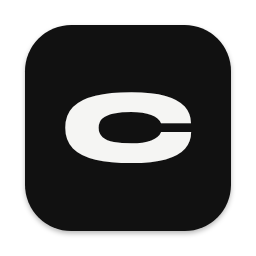
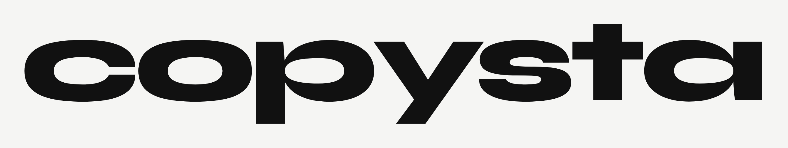
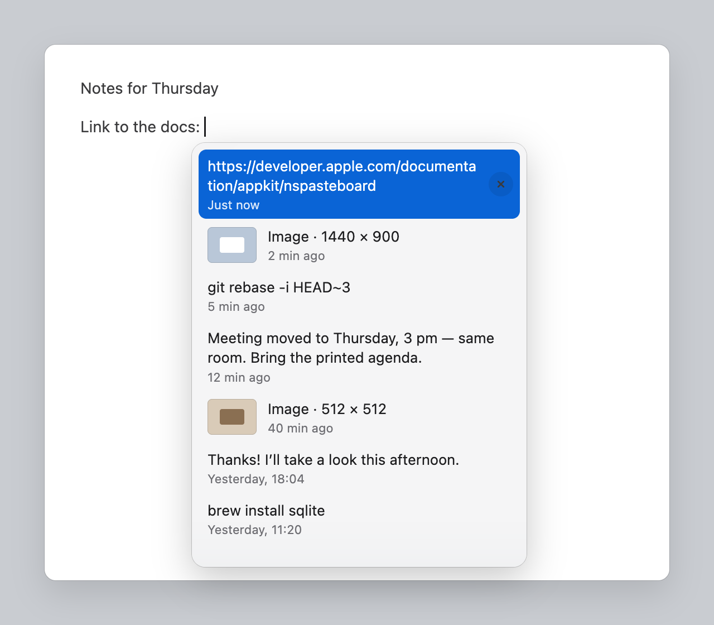
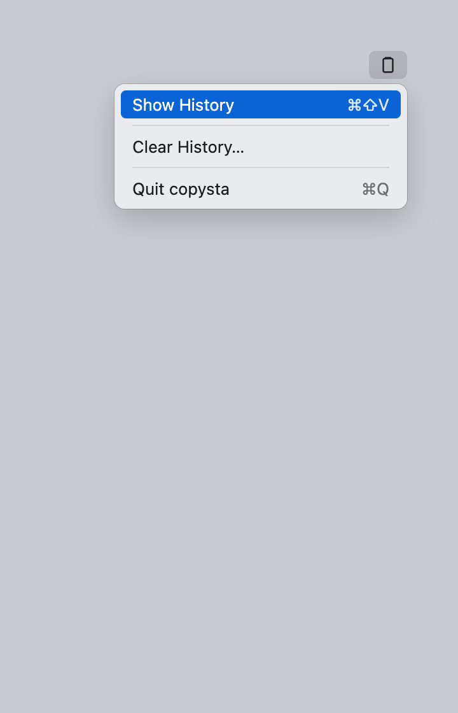
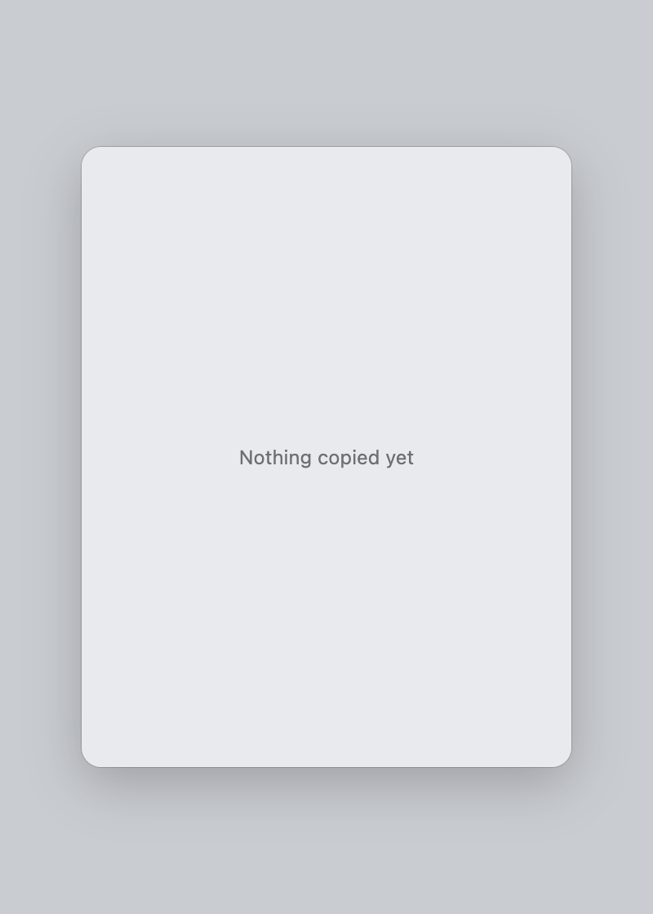

<p align="center">
  
</p>

<p align="center">
  
</p>

---

hit `⌘⇧v` and your clipboard history shows up right under your cursor.

<p align="center">
  
</p>

### what it does

- keeps the last 500 things you copied, text and images
- `⌘⇧v` opens it next to wherever you're typing
- arrows to pick, enter to paste, or just click
- lives in the menu bar, no dock icon
- skips password manager stuff
- everything stays on your mac

<p align="center">
  
  &nbsp;&nbsp;
  
</p>

### install

needs macos 13+ and the xcode command line tools.

```sh
make bundle
open copysta.app
```

then give it accessibility access in system settings → privacy & security → accessibility. it needs that for the hotkey and to find your cursor.

### notes

- works best in native apps (notes, textedit, xcode). chrome and vs code mostly work, sometimes it lands a little off
- history lives in `~/Library/Application Support/copysta`
- rebuilding resets the accessibility permission

### stack

swift, appkit, swiftui, sqlite. no dependencies.
